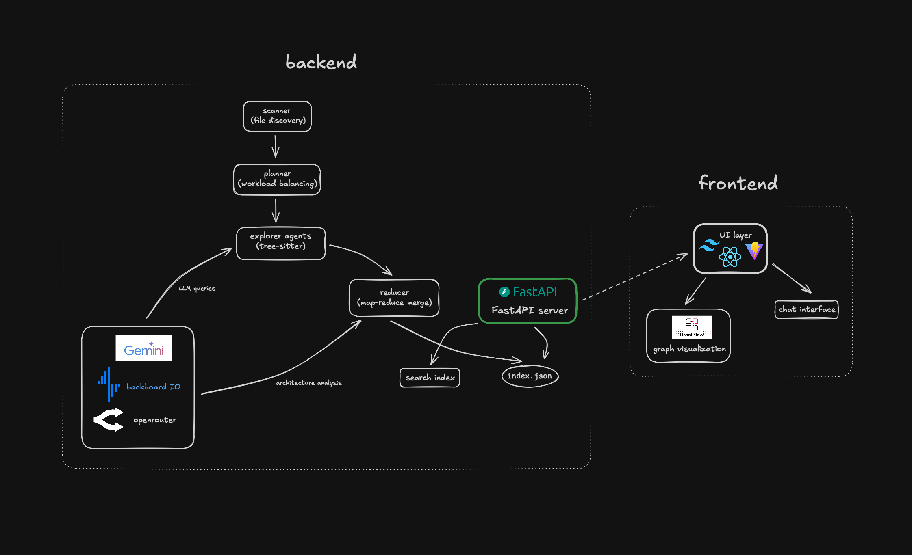

<div align="center">


# DocBot

**The technical GPS for _any_ codebase.**

</div>

---

Documentation is almost always outdated or non-existent. **DocBot** solves this by autonomously mapping your system architecture in seconds, not days. It parallelizes codebase exploration using specialized agents to extract deep semantic understanding—from high-level components to individual symbols.

## Features

- **Interactive Architecture Maps**: Dynamically renders a whiteboard-style graph of your entire system that you can actually chat with.
- **Git-Integrated Workflow**: Built-in git hooks (post-commit/merge) and CLI tools (`docbot status`, `docbot diff`) to keep docs in perfect sync with your code.
- **Autonomous Explorer Agents**: Uses Tree-sitter and LLMs to investigate symbols, trace dependencies, and uncover the "heart" of your logic while you code.
- **One-Click Generation**: Zero-config needed. Run `docbot init` on any repository and get a fully functional documentation site instantly.
- **Live Pipeline Visualization**: Includes a built-in telemetry server to watch the agentic exploration process in real-time.

## Quick Start

1. **Install**

   ```bash
   git clone <repo-url> && cd docbot
   uv pip install -e .
   ```

2. **Configure**
   Create a `.env` file with your `BACKBOARD_API_KEY`.

3. **Initialize & Generate**

   ```bash
   docbot init
   docbot generate --viz
   ```

4. **Explore**
   ```bash
   docbot serve
   ```

## Commands

| Command               | Description                                 |
| --------------------- | ------------------------------------------- |
| `docbot init`         | Initialize `.docbot/` directory and config. |
| `docbot generate`     | Run the full documentation pipeline.        |
| `docbot update`       | Incremental update for changed files.       |
| `docbot status`       | Show documentation lag and affected scopes. |
| `docbot diff`         | Compare two architecture snapshots.         |
| `docbot serve`        | Launch the interactive explorer UI.         |
| `docbot hook install` | Install git hooks for auto-documentation.   |

## Options

Flags for `docbot generate`:

| Flag            | Description                                       |
| --------------- | ------------------------------------------------- |
| `--viz`         | Launch live pipeline telemetry server.            |
| `--agents`      | Enable recursive agentic exploration (deep-dive). |
| `--no-llm`      | Skip AI enrichment (static extraction only).      |
| `--concurrency` | Parallel worker count (default: 4).               |
| `--model`       | Override default model ID.                        |

## How It Works

DocBot uses a high-concurrency **Map-Reduce** pipeline:

1. **Scan**: Multi-language discovery and entrypoint mapping.
2. **Plan**: Dependency-aware grouping into logical "scopes".
3. **Explore**: Parallel AST extraction (Tree-sitter) and LLM-agent reasoning.
4. **Reduce**: Cross-scope graph construction and anomaly detection.
5. **Render**: Generation of Markdown, Mermaid diagrams, and Search Index.

### Architecture



## Project Structure

- `src/docbot/pipeline/`: Core Map-Reduce logic (Scanner, Planner, Explorer, etc.)
- `src/docbot/git/`: Git-aware logic (Snapshotting, Diffing, Hooks)
- `src/docbot/viz/`: Pipeline telemetry and replay server
- `src/docbot/extractors/`: Language-specific AST analysis
- `webapp/`: React + Vite + ReactFlow + Tailwind frontend

## Stack

- **Backend**: Python, FastAPI, Typer, Pydantic, Tree-sitter
- **Frontend**: React, Vite, React Flow (interactive graphs), Tailwind
