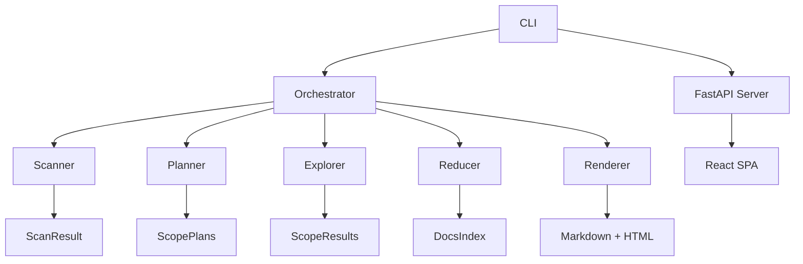

# docbot

**Auto-document any codebase.**

Scans your repo, extracts structure via tree-sitter (or LLM fallback for unsupported languages), and generates
a full documentation site: architecture diagrams, API references, and env var catalogs. Every generated line
is traceable back to source code. Includes an interactive webapp with AI chat, system graph, guided tours,
and code navigation.

## Quick Start

1. **Install**

    ```bash
    git clone <repo-url> && cd docbot
    uv pip install -e .
    ```

2. **Configure**
   Create a `.env` file:

    ```bash
    OPENROUTER_KEY=sk-or-...
    ```

3. **Initialize & Generate**

    ```bash
    cd /path/to/your/project
    docbot init
    docbot generate
    ```

4. **Explore**
    ```bash
    docbot serve
    ```
    Opens the interactive webapp in your browser.

## Commands

| Command                       | Description                                                     |
| ----------------------------- | --------------------------------------------------------------- |
| `docbot init [path]`          | Create `.docbot/` directory with config and gitignore           |
| `docbot generate [path]`      | Run the full documentation pipeline, output to `.docbot/`       |
| `docbot update [path]`        | Incremental update -- only re-process scopes with changed files |
| `docbot status [path]`        | Show doc state: last run, changed files, affected scopes        |
| `docbot serve [path]`         | Launch interactive webapp against `.docbot/`                    |
| `docbot config [key] [value]` | View or modify `.docbot/config.toml` settings                   |
| `docbot hook install`         | Install post-commit git hook for automatic doc updates          |
| `docbot hook uninstall`       | Remove the docbot git hook                                      |

## Options

Flags for `docbot generate` (override config.toml values for that invocation):

| Flag                  | Description                                           |
| --------------------- | ----------------------------------------------------- |
| `--no-llm`            | Skip LLM enrichment (extraction only).                |
| `--model / -m`        | OpenRouter model ID (default: openai/gpt-oss-20b).    |
| `--concurrency / -j`  | Parallel explorer workers (default: 4).               |
| `--timeout / -t`      | Per-scope timeout in seconds (default: 120).          |
| `--max-scopes`        | Maximum number of documentation scopes (default: 20). |
| `--visualize / --viz` | Open live D3.js pipeline visualization.               |

## How It Works

Five-stage async pipeline:

1. **Scan** -- finds source files across all languages, classifies entrypoints and packages.
2. **Plan** -- groups files into logical documentation scopes (LLM-refined).
3. **Explore** -- extracts symbols, imports, and references per scope (tree-sitter for Python/TS/JS/Go/Rust/Java/Kotlin/C#/Swift/Ruby, LLM fallback for everything else). Runs in parallel.
4. **Reduce** -- merges scope results, builds a cross-file dependency graph, generates cross-scope analysis.
5. **Render** -- generates per-scope Markdown docs, README, architecture overview, API reference, and HTML report.

All narrative content is LLM-generated. The `--no-llm` flag falls back to template-based output.

## Development

```bash
# 1. Install in editable mode
uv venv && .venv\Scripts\activate    # Windows
uv pip install -e .

# 2. Initialize and generate docs
docbot init .
docbot generate

# 3. Start the webapp (API + frontend)
docbot serve
```

For frontend development, run the React dev server separately:

```bash
cd webapp
npm install && npm run dev
```

The Vite dev server at http://localhost:5173 proxies API calls to the FastAPI backend.

## Project Structure

```
src/docbot/
  cli.py              # Typer CLI entry point
  models.py           # Pydantic data models
  llm.py              # Async OpenRouter LLM client
  orchestrator.py     # 5-stage pipeline coordinator
  scanner.py          # Stage 1: file discovery
  planner.py          # Stage 2: scope planning
  explorer.py         # Stage 3: per-scope extraction + LLM enrichment
  reducer.py          # Stage 4: cross-scope analysis + dependency graph
  renderer.py         # Stage 5: doc generation
  server.py           # FastAPI backend
  search.py           # BM25 search index
  project.py          # .docbot/ directory management
  git_utils.py        # Git CLI wrappers
  hooks.py            # Git hook install/uninstall
  tracker.py          # Pipeline state tracking (for visualization)
  viz_server.py       # Live D3.js visualization server
  extractors/         # Language-specific extraction (tree-sitter + LLM fallback)
webapp/               # React SPA (Vite + ReactFlow + Tailwind)
```

## Stack

-   **Core**: Python 3.11+, Typer, Pydantic, AsyncIO
-   **AI**: OpenRouter API (any model)
-   **Extraction**: tree-sitter (10 languages) + LLM fallback (universal)
-   **Webapp**: React + Vite + ReactFlow + Tailwind (frontend), FastAPI + Uvicorn (backend)

## Architecture


# Test change
