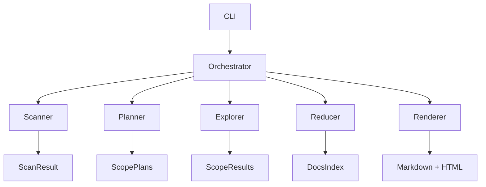

# docbot

**Auto-document any Python codebase.**

Scans your repo, extracts the AST, and generates a full documentation site: architecture diagrams, API references, and env var catalogs. Every generated line is traceable back to source code.

## Quick Start

1. **Install**

   ```bash
   git clone <repo-url> && cd docbot
   uv pip install -e .
   ```

2. **Configure**
   Create a `.env` file:

   ```bash
   OPENROUTER_KEY=sk-or-...
   ```

3. **Run**
   ```bash
   docbot ./my-project
   ```

## Development

Run the backend and frontend in separate terminals:

**Terminal 1 (Backend):**

```bash
# 1. Activate venv & install
uv venv && source .venv/bin/activate
uv pip install -e .

# 2. Scan the repo to generate data
docbot run . --output docbot_data

# 3. Start the API server
docbot serve docbot_data
```

**Terminal 2 (Frontend):**

```bash
cd webapp
npm run dev
```

Open [http://localhost:5173](http://localhost:5173) to view the app.

## Options

| Flag                | Description                                |
| ------------------- | ------------------------------------------ |
| `--no-llm`          | Run local extraction only (free/fast).     |
| `--model <id>`      | Switch LLM model (default: xiaomi/mimo-v2-flash). |
| `--concurrency <N>` | Parallel workers (default: 4).             |
| `--output <path>`   | Base directory for run output.             |

## How It Works

1. **Scan**: Finds source files and entrypoints.
2. **Plan**: Groups files into logical documentation scopes.
3. **Explore**: Extracts symbols, imports, and references (AST/Tree-sitter).
4. **Reduce**: Builds a cross-file dependency graph.
5. **Render**: Generates Markdown/HTML artifacts.

## Stack

- **Core**: Python 3.11+, Typer, Pydantic, AsyncIO.
- **AI**: OpenRouter API.
- **Webapp**: React + FastAPI (Coming Soon).

## Architecture


